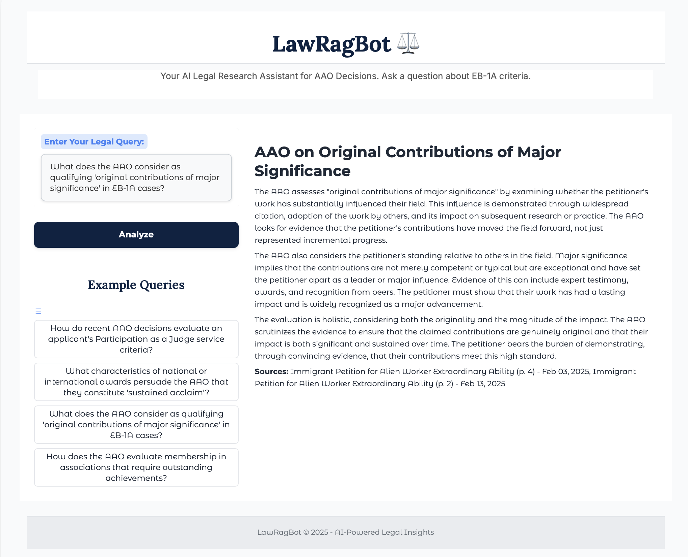
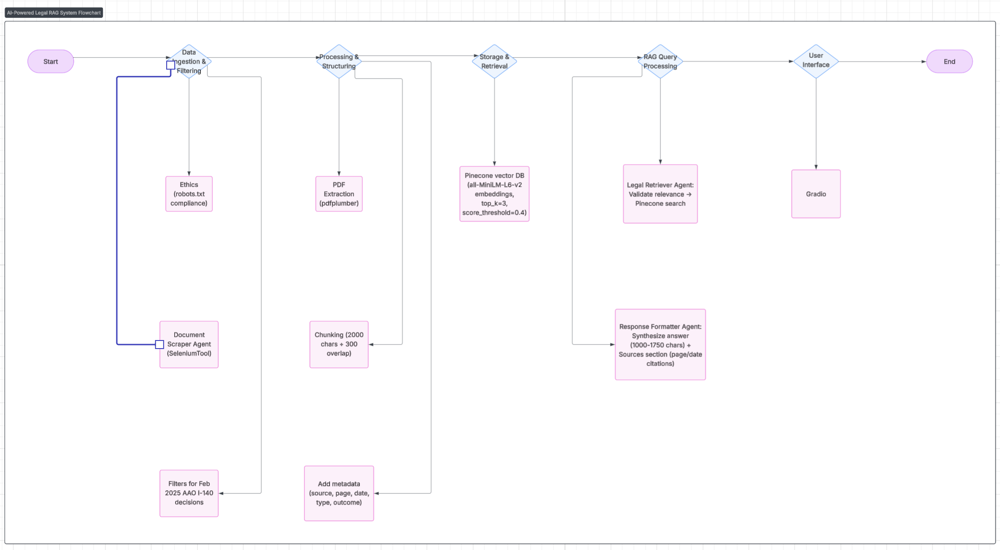

# LawRagBot ⚖️



## 🏗️ System Architecture



*Complete system architecture and data flow diagram*

**AI-Powered Legal Research Assistant for USCIS AAO Decisions**

LawRagBot is an advanced legal document analysis system that combines intelligent web scraping with Retrieval Augmented Generation (RAG) capabilities. It specializes in analyzing USCIS Administrative Appeals Office (AAO) I-140 Extraordinary Ability decisions, providing AI-powered insights through a user-friendly web interface.

**Data Source**: This system performs automated web scraping from the official USCIS AAO Non-Precedent Decisions page: https://www.uscis.gov/administrative-appeals/aao-decisions/aao-non-precedent-decisions

## 🌟 Features

- **🤖 Intelligent Web Scraping**: Automated extraction of PDF documents from USCIS AAO pages
- **🔍 Semantic Search**: Advanced vector-based search using sentence transformers
- **⚖️ Legal Analysis**: AI agents specialized in immigration law and AAO decision patterns
- **📝 Professional Formatting**: Structured responses with proper legal citations
- **🛡️ Query Validation**: Built-in prompt injection prevention and relevance checking
- **🎨 Modern UI**: Clean, professional Gradio-based web interface
- **📊 Metadata-Rich**: Comprehensive document metadata including decision outcomes, dates, and petition types

## 🚀 Quick Start

### Prerequisites

- Pinecone API Key
- Google Gemini API Key

### Installation

1. **Clone the repository**
   ```bash
   git clone https://github.com/your-username/LawRagBot.git
   cd LawRagBot
   ```

2. **Install dependencies**
   ```bash
   pip install -r requirements.txt
   ```

3. **Set up environment variables**
   Copy the example environment file and add your API keys:
   ```bash
   cp env.example .env
   ```
   Then edit `.env` and add your actual API keys:
   ```env
   PINECONE_API_KEY=your_pinecone_api_key
   GEMINI_API_KEY=your_gemini_api_key
   ```

4. **Initialize the system**
   ```bash
   # Process PDFs and set up Pinecone vector database
   python setup_pinecone.py
   
   # Launch the web interface
   python app.py
   ```

## 💻 Usage

### Web Interface

1. Launch the application: `python app.py`
2. Open your browser to the provided URL (typically `http://localhost:7860`)
3. Enter your legal query in the text field
4. Click "Analyze" to get AI-powered insights

### Example Queries

- "How do recent AAO decisions evaluate an applicant's Participation as a Judge service criteria?"
- "What characteristics of national or international awards persuade the AAO that they constitute 'sustained acclaim'?"
- "What does the AAO consider as qualifying 'original contributions of major significance' in EB-1A cases?"
- "How does the AAO evaluate membership in associations that require outstanding achievements?"

### Command Line Usage

```python
from tasks import LegalRAGSystem

# Initialize the RAG system
rag_system = LegalRAGSystem()

# Query the system
result = rag_system.answer_query("Your legal question here")
print(result)
```

## 🏗️ Architecture

### System Overview

The detailed system architecture is illustrated in the flowchart above, showing the complete data flow from document ingestion to user interaction:

1. **Data Ingestion & Filtering**: Ethics compliance validation and document scraping
2. **Processing & Structuring**: PDF extraction, chunking, and metadata addition  
3. **Storage & Retrieval**: Pinecone vector database with semantic search capabilities
4. **RAG Query Processing**: Legal retriever and response formatter agents
5. **User Interface**: Gradio-based web interface for seamless interaction

### Key Components

#### 1. **AI Agent Architecture (CrewAI)**
- **Document Scraper Agent**: Extracts PDF links from USCIS pages using Selenium
- **Legal Retriever Agent**: Performs semantic search and query validation
- **Legal Formatter Agent**: Synthesizes findings into structured legal analysis

#### 2. **Vector Database (Pinecone)**
- Cloud-based vector storage for scalability
- Cosine similarity search with `all-MiniLM-L6-v2` embeddings (384 dimensions)
- Metadata-enriched chunks for precise citation

#### 3. **Document Processing Pipeline**
- **Text Extraction**: `pdfplumber` for accurate PDF parsing
- **Chunking Strategy**: 2000-character chunks with 300-character overlap
- **Metadata Extraction**: Automated extraction of decision dates, petition types, and outcomes

#### 4. **RAG Query Processing**
1. **Query Validation**: Checks relevance to USCIS AAO decisions and U.S. immigration law
2. **Semantic Retrieval**: Vector search with `score_threshold=0.4`, `top_k=3`
3. **Response Formatting**: Structured analysis with controlled citation format

## 📁 Project Structure

```
LawRagBot/
├── README.md                 # This file
├── requirements.txt          # Python dependencies
├── .env                     # Environment variables (create this)
├── agents.py                # AI agent definitions
├── tasks.py                 # CrewAI tasks and RAG system orchestration
├── tools.py                 # Custom tools (SeleniumTool, PineconeSearchTool)
├── app.py                   # Gradio web interface
├── setup_pinecone.py        # Document processing and vector database setup
├── webscraper.py            # Standalone document collection script
├── project_architecture.txt # Technical design documentation
└── data/
    └── pdfs/               # Downloaded legal documents
```

## 🛠️ Technical Specifications

### Technology Stack
- **Backend**: Python, CrewAI, LangChain
- **AI Models**: Google Gemini 1.5 Flash (Scraper), Gemini 2.0 Flash (RAG Agents)
- **Vector Database**: Pinecone (cloud)
- **Embeddings**: Sentence Transformers (`all-MiniLM-L6-v2`)
- **Web Scraping**: Selenium WebDriver
- **PDF Processing**: pdfplumber
- **Web Interface**: Gradio
- **Data Validation**: Pydantic

### Search Strategy
- **Semantic Search**: Dense vector embeddings with cosine similarity
- **Score Threshold**: 0.4 (configurable)
- **Top-K Retrieval**: 3 most relevant chunks
- **Query Validation**: Automatic relevance checking and prompt injection prevention

### Response Format
- **Analytical Content**: 1000-1750 characters (strictly enforced)
- **Citations**: Separate "Sources:" section (excluded from character count)
- **Citation Format**: `Immigrant Petition for Alien Worker Extraordinary Ability (p. X) - Month DD, YYYY`
- **Output**: Professional markdown with proper legal structure

## 📊 Data & Metadata

### Document Metadata Structure
```python
{
    "source_file": str,           # PDF filename
    "page_number": float,         # Page location
    "decision_date": str,         # Format: "MMMDDYYYY"
    "petition_type": str,         # "EB-1A Extraordinary Ability", etc.
    "decision_outcome": str,      # "Remanded", "Denied/Dismissed", etc.
    "chunk_index": int,           # Chunk sequence number
    "start_char": int,            # Character position start
    "end_char": int              # Character position end
}
```

### Current Dataset
- **22 USCIS AAO I-140 Extraordinary Ability decisions** (February 2025 focus)
- **~16MB of legal content** vectorized and stored
- **Decision Outcomes**: Covers various AAO determinations including remands and dismissals

## 🔧 Configuration

### Environment Variables
```env
# Required
PINECONE_API_KEY=your_pinecone_api_key_here
GEMINI_API_KEY=your_gemini_api_key_here

# Optional
GRADIO_SERVER_NAME=0.0.0.0
GRADIO_SERVER_PORT=7860
GRADIO_SHARE=False
```

### Customization Options
- **Chunk Size**: Modify in `setup_pinecone.py` (default: 2000 characters)
- **Search Parameters**: Adjust `score_threshold` and `top_k` in tools configuration
- **Response Length**: Configure character limits in agent instructions
- **UI Theme**: Customize CSS in `app.py`

## 🚦 Running the System

### Development Mode
```bash
# Run with auto-reload
python app.py
```

### Production Deployment
```bash
# Set production environment variables
export GRADIO_SERVER_NAME=0.0.0.0
export GRADIO_SERVER_PORT=7860

# Launch application
python app.py
```

## 🧪 Testing

### System Test
```bash
# Test the RAG system with a sample query
python setup_pinecone.py
```

### Query Examples for Testing
1. Basic functionality: "How is extraordinary ability evaluated?"
2. Specific criteria: "What evidence satisfies the judging criterion?"
3. Edge case: "Tell me about cooking recipes" (should trigger off-topic response)

## 🤝 Contributing

1. Fork the repository
2. Create a feature branch (`git checkout -b feature/AmazingFeature`)
3. Commit your changes (`git commit -m 'Add some AmazingFeature'`)
4. Push to the branch (`git push origin feature/AmazingFeature`)
5. Open a Pull Request

## 📈 Future Enhancements

- **Advanced RAG**: Query rewriting, hybrid search, query decomposition
- **Enhanced UI**: Interactive PDF viewer, report export functionality
- **Intelligent Ingestion**: AI-driven adaptive scraping and multi-source integration
- **Legal NLP**: Specialized named entity recognition, citation graphs, temporal analysis

## 📄 License

This project is licensed under the MIT License - see the [LICENSE](LICENSE) file for details.

## 🙏 Acknowledgments

- USCIS Administrative Appeals Office for publicly available decisions
- Google for Gemini API access
- Pinecone for vector database services
- The open-source community for the foundational tools and libraries


**LawRagBot © 2025 - AI-Powered Legal Insights** 